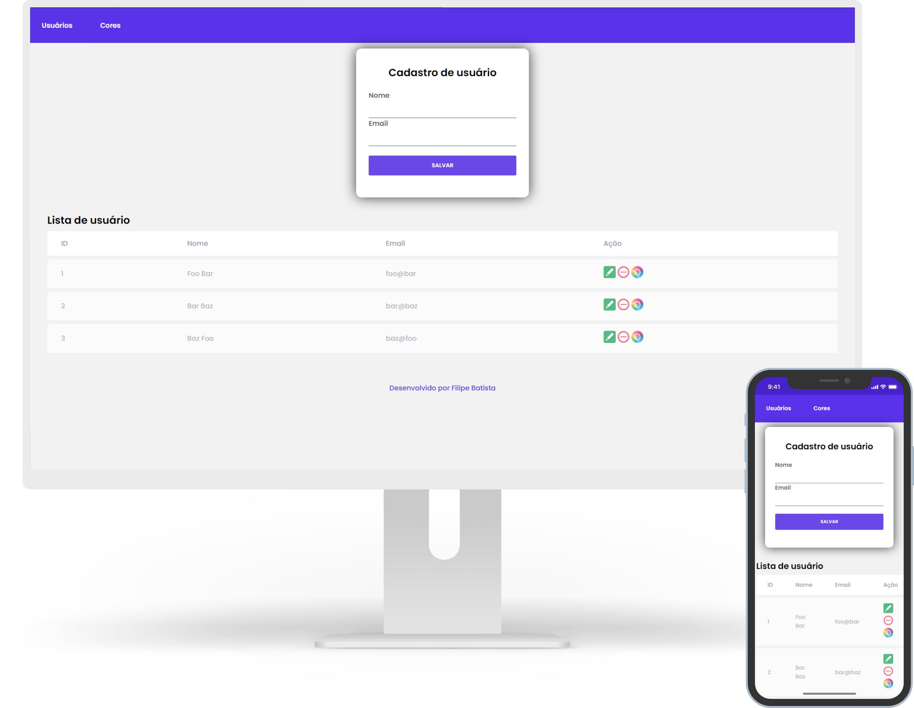

# Indice

- [Sobre](#-sobre)
- [Tecnologias](#Tecnologias)
- [Como baixar o projeto](#-como-baixar-o-projeto)

## 🔖&nbsp; Sobre

Projeto desenvolvido para a teste da empres [BDTI](https://bdti.com.br/)

## Objetivo
 Criar um Crud simples, totalmente desenvolvido em PHP, sem a utilização de frameworks, onde será possível Criar/Editar/Excluir/Listar usuários. O sistema também deve possuir a possibilidade de vincular/desvincular várias cores ao usuário. Ver mais em [Instructions.md](INSTRUCTIONS.md)

---
## Tecnologias

Esse projeto foi desenvolvido com as seguintes tecnologias:

- [PHP](https://www.php.net/manual/pt_BR/intro-whatis.php)
- [SQLITE3](https://www.sqlite.org/index.html)

---

## 🗂 Como baixar o projeto

```bash

    # Clonar o repositório
    $ git clone https://github.com/filipeleonelbatista/Crud-usuarios-BDTI.git

    # Entrar no diretório desejado
    $ cd Crud-usuarios-BDTI

    # Para rodar em PHP usei o xampp para windows
```

---

<h3 align="center" >Vamos nos conectar 😉</h3>
<p align="center">
  <a href="https://www.linkedin.com/in/filipelbatista/">
    
  </a>&ensp;
  <a href="mailto:filipe.x2016@gmail.com">
    
  </a>&ensp;
  <a href="https://instagram.com/filipegaucho22">
    
  </a>
</p>
<br />
<p align="center">
    Desenvolvido 💜 por Filipe Batista 
</p>
